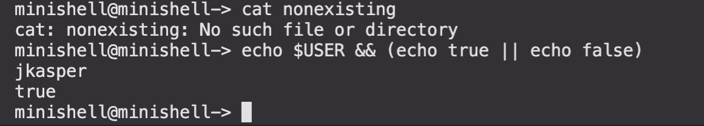

# minishell
## A custom shell written by **mstrantz**(imexz) and **jkasper**(kyomawolf), with features required by the 42 subject sheet

---
You can compile by using the `compile.sh` script or by figuring out our makefile ;)
If you have the readline library installed with brew (see the makefile where we try to locate it), you can compile with

`compile.sh readline`

A little warning regarding the readline library:
The readline library has leaks, so if you are using our program on system without a garbage collector, you have been warned
if you do not have the readline installed, you are still able to use our shell with some missing features, like a working history
or the autocompletion functionality using tab, simply by compiling without the readline argument:

`compile.sh`

## Features we implemented, according to the features required by the subject sheet:
- a prompt
- a working history (with readline library)
- program execution with PATH enviroment variable, absolute and relative path
- handling of single quotes `'`
- handling of double quotes `"`
- redirections such as `<`(input) `>`(output (mode: replace)) `>>` (output (mode: append))
- heredoc `<<` (read until delimiter occurs; example command: `cat << END`; will read until END occurs in a single line)
- piping with `|`
- usage and handling of enviroment variables
- $? (expanding to the exit status of the most recent executed foreground pipe)
- Signal handling like bash (CTRL-C CTRL-D CTRL-\\) (a bit buggy without readline)
- following builtins:
  - `echo` with `-n` flag
  - `cd` (relative or absolute path)
  - `pwd` (witout flags)
  - `export` (without flags)
  - `unset` (without flags)
  - `env` (without flags or args)
  - `exit` (without flags)

## Also with bonus part we had to implement:
-  logical operator `&&` and `||` with parenthesis (only for priorities)
-  wildcard `*` (only for current working directory)
